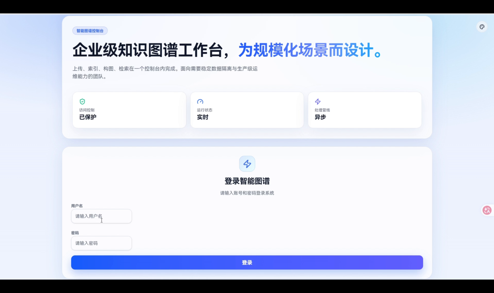

# 智能图谱控制台（基于 LightRAG 二开）

这是一个基于 LightRAG API 的工程化增强版本，提供：

- 多图谱空间隔离
- 可配置实体类型抽取
- 模型配置中心（多供应商接入）
- 文档到思维导图自动化
- 前后端一体化 Docker 部署

## 示例视频

[](./demo/%E7%A4%BA%E4%BE%8B.mp4?raw=1)

- [点击下载示例视频](./demo/%E7%A4%BA%E4%BE%8B.mp4?raw=1)

## 二开特性

1. 多 Workspace 隔离：
一个服务内管理多个图谱空间，文档、图谱、状态相互隔离，避免串数据。

2. 抽取策略可控：
上传文档时可自定义实体类型（如人物、机构、地点、事件等），让抽取更贴合业务。

3. 模型接入灵活：
支持 OpenAI 兼容方式接入火山、通义、智谱、vLLM、Ollama 等（按 URL/Key/Model 配置）。

4. 检索体验增强：
支持检索“思考开关”（默认关闭），可在质量与时延之间按场景平衡。

5. 知识产出闭环：
文档上传处理完成后可自动触发思维导图，并支持手动刷新。

## 目录说明

- `lightrag/`：后端 API 与核心逻辑
- `lightrag_webui/`：前端 WebUI（Vite + React）
- `inputs/`：输入文档目录（运行时数据）
- `rag_storage/`：图谱与向量存储（运行时数据）
- `.env.example`：后端环境变量模板

## 本地开发

### 1) 基础依赖

- Python 3.11+（推荐 3.12）
- Node.js 20+
- npm 10+

### 2) 后端安装

```bash
python -m venv .venv
# Windows
.venv\Scripts\activate
# Linux/macOS
# source .venv/bin/activate

pip install -U pip setuptools wheel
pip install -e .[api]
```

### 3) 前端安装

```bash
cd lightrag_webui
npm ci
cd ..
```

### 4) 环境变量

```bash
cp .env.example .env
cp lightrag_webui/.env.example lightrag_webui/.env
```

至少配置以下关键项：

- `AUTH_ACCOUNTS`
- `TOKEN_SECRET`
- `LLM_BINDING` / `LLM_MODEL` / `LLM_BINDING_HOST` / `LLM_BINDING_API_KEY`
- `EMBEDDING_BINDING` / `EMBEDDING_MODEL` / `EMBEDDING_BINDING_HOST` / `EMBEDDING_BINDING_API_KEY`

### 5) 启动

后端：

```bash
lightrag-server --host 0.0.0.0 --port 9621
```

前端：

```bash
cd lightrag_webui
npm run dev-no-bun
```

## Docker 部署

```bash
cp .env.example .env
docker compose build --no-cache kg
docker compose up -d kg
```

访问：

- WebUI: `http://<server-ip>:9621/webui`
- Swagger: `http://<server-ip>:9621/docs`

## 提交仓库注意事项

本仓库已忽略：

- `.env`、`lightrag_webui/.env`
- `inputs/`、`rag_storage/`
- `*.log`、缓存与构建产物
